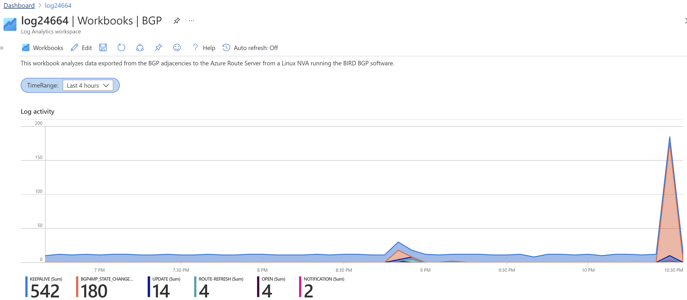
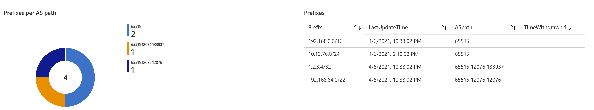
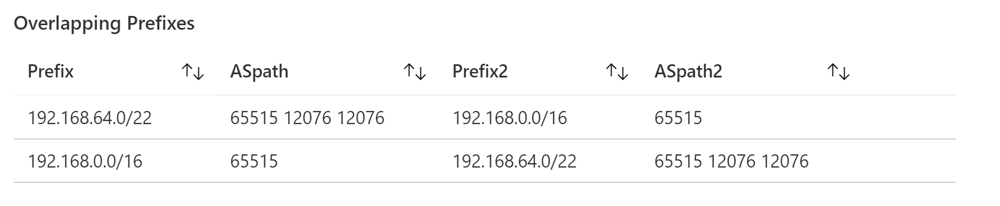

# BGP Analytics with Azure Monitor

This repository contains some sample code to implement a basic solution for BGP analytics in Azure. The goal is monitoring routing events such as the following:

- Monitor virtual Networks added to a hub and spoke topology
- Identify routes injected via ExpressRoute or site-to-site VPN
- Monitor BGP Autonomous System paths in use
- Identify potential problems such as overlapping advertised prefixes

## BGP Analytics Azure Setup

A possible first approach might be getting different route tables (for example from the ExpressRoute or VPN gateways) at regular intervals and logging the results into a log management system. However, this regular polling has the problem of potentially missing events that happen between polling intervals, such as route or adjacency flaps.

The desired architecture should follow a push, rather than a pull approach, and originate messages whenever some event at the BGP level happens. The new [Azure Route Server](https://docs.microsoft.com/azure/route-server/overview) offers an API into the routing processes running inside of a Virtual Network.

Hence, the approach I follow here is getting all routes from the Azure Route Server in a Network Virtual Appliance (NVA), and configuring the BGP software to push BGP events to Azure Monitor. If you want to build a similar setup in Azure, I put a CLI script that will deploy all components [here](./nva.azcli).

As NVA I will use a Linux appliance with the [BIRD](https://bird.network.cz/) BGP software. BIRD supports logging received BGP messages with the Multi-Threaded Routing Toolkit (MRT) format, documented in [RFC 6396](https://tools.ietf.org/html/rfc6396). BIRD will log all received messages into a file, that can be interpreted with tooling such as the [mrtparse Python module](https://github.com/t2mune/mrtparse).

After decoding the messages, they can be sent to Azure Monitor using the [HTTP Data Collection API](https://docs.microsoft.com/azure/azure-monitor/logs/data-collector-api) (in public preview at the time of this writing). The script reading the MRT messages and sending them to Azure Monitor can be run per intervals, and will get the required credentials with a user managed identity, so that no secret needs to be coded anywhere. The script I used can be found in this repository [here](./mrt2azmon.py).

The script does some formatting before sending the messages to Azure Monitor, such as flattening the JSON structure, but the details are not critical.

After the logs arrive to Azure Monitor, they can be analyzed with Kusto queries, to achieve our initial objectives. The workbook containing the charts in this document can be obtained from this repository [here](./workbook.json).

## Azure Monitor Workbook Example

As examples of some queries that would be helpful, I started with a brief histogram analysis of the BGP message types sent over time. As the following picture shows, there is a relatively constant level of BGP keepalive messages over time, and changes to that constant pattern can be easily identified in the timeline.

For example, the first bump in the chart below (at around 8:50pm) corresponds to attaching an ExpressRoute circuit to the VNet. The second and larger one (at around 10:30pm) is due to a test simulating an outage during which the BGP adjacencies between Route Server and NVA were torn down during some time, and then restablished.

The second set of queries give an idea of the amount of prefixes and AS paths existing in the network. This is important, for example to identify unwanted routes coming from unexpected AS paths. One use case where this could be relevant is when a BGP misconfiguration on premises sends prefixes learnt over the ExpressRoute Microsoft peering towards the private peering. This kind of visuals would help to identify that problem very quickly.

And lastly, different problematic scenarios can be identified through careful analysis of the routes. In this example the BGP messages are searched to find overlapping routes, which might happen if different Virtual Networks with overlapping IP prefixes are connected to the same ExpressRoute circuit (yes, Azure will allow you to do that):

Additional queries might focus on the route table stability to identify route flapping, or other aspects that can be important for the correct operation of the network.

Hopefully this will give you an idea of what can be possible by analyzing your BGP routes. Whether you use your own setup like here, or a commercial product, there are many insights to be gained by having a deep look into your BGP cogwheels.
